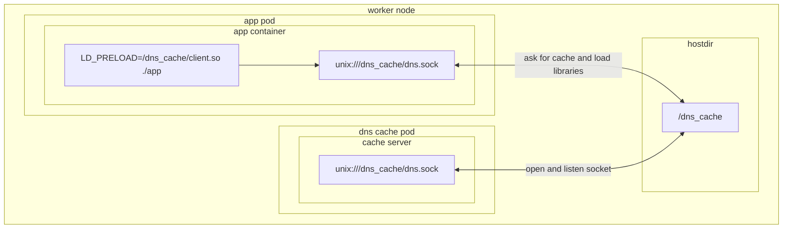

# LD_PRELOAD Client with Global DNS Cache Server

This setup involves a client-server architecture where the client intercepts DNS resolution requests and the server handles these requests with caching.

- **Client**: A library written in C, loaded into any container using `LD_PRELOAD`. This client library replaces the original user-space function `gethostbyname_r` with a custom function that communicates with the server.
- **Server**: An application written in Go that resolves DNS queries from clients and maintains a DNS cache.
- All communication between the client and the server is conducted through a Unix socket.




### Demo

1. Run docker-compose setup:
```
> docker compose build
> docker compose up
```
2. Send requests:
```
> while true; do curl http://localhost:80 ; done;
...
64.233.164.113
64.233.164.100
168.62.201.205
64.233.164.100
168.62.201.205
64.233.164.113
...
```

3. See docker compose logs:
```
second-server-1  | Got message: 'google.com'
second-server-1  | Cache warmup google.com
second-php-1     | 172.23.0.3 -  27/Feb/2024:17:15:41 +0000 "GET /index.php" 200
second-nginx-1   | 172.23.0.1 - - [27/Feb/2024:17:15:41 +0000] "GET / HTTP/1.1" 200 25 "-" "curl/7.88.1" "-"
second-server-1  | Got message: 'google.com'
second-server-1  | Cache hit google.com
second-php-1     | 172.23.0.3 -  27/Feb/2024:17:15:43 +0000 "GET /index.php" 200
second-nginx-1   | 172.23.0.1 - - [27/Feb/2024:17:15:43 +0000] "GET / HTTP/1.1" 200 27 "-" "curl/7.88.1" "-"
second-server-1  | Got message: 'google.com'
second-server-1  | Cache hit google.com
second-php-1     | 172.23.0.3 -  27/Feb/2024:17:15:44 +0000 "GET /index.php" 200
second-nginx-1   | 172.23.0.1 - - [27/Feb/2024:17:15:44 +0000] "GET / HTTP/1.1" 200 27 "-" "curl/7.88.1" "-"
```